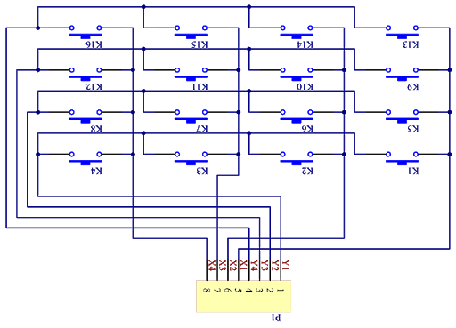
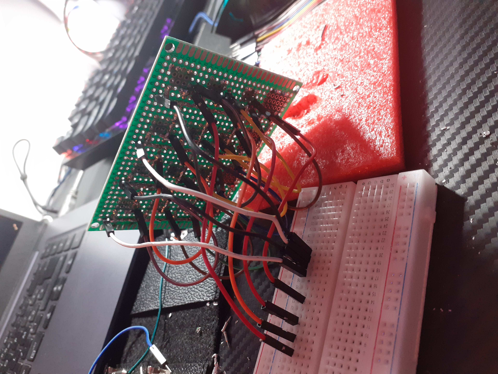
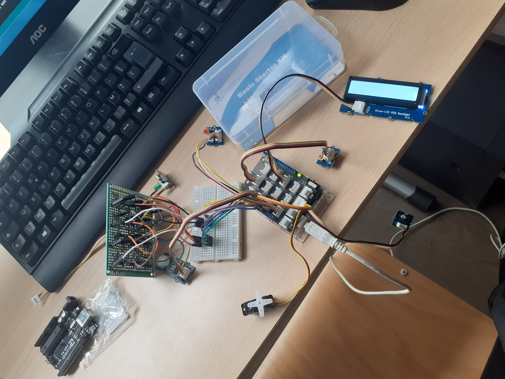
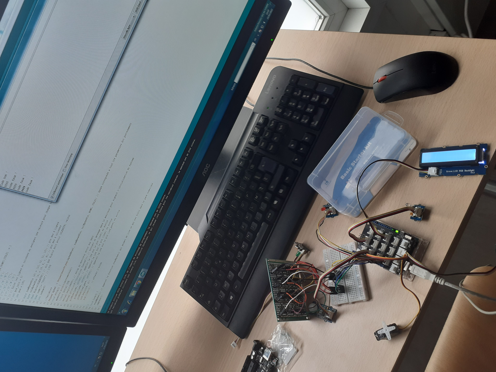

# Digicode

Nous avons fait un digicode avec Arduino ainsi qu'un lampe automatique qui S'il fait nuit(ou il y a peu de lumiere) et qu'il y a un mouvement une lampe éclaire le digicode 
## Branchement
le pavé numerique est en `9, 8, 7, 6` pour les colonnes et `13, 12, 11, 10` pour les lignes 

Qui donne:

les leds (grove):
 * rouge => `4`
 * verte => `3`
 * branche => `5`

les capteurs (grove):
 
 * mouvement => `2`
 * luminosité => `A1`

l'écran  (grove):

 * lcd => `I2C`

## image du projet

## Modules utilisés

 * [Grove]( https://wiki.seeedstudio.com/Grove_System/) qui permets des branchement simple avec les composants ()

 * [Keypad]( https://playground.arduino.cc/Code/Keypad/) qui permets d'utilisé un pavé numerique de 4x4

 * [Servo Moteur]( https://www.arduino.cc/reference/en/libraries/servo/) qui permets d'utilisé des servos moteurs

 * [écran lcd]( https://www.arduino.cc/reference/en/libraries/grove-lcd-rgb-backlight/) qui permets d'utilisé des écrans LCD 

 * [Wire](https://www.arduino.cc/en/reference/wire) qui permets la communication par le protocole I2C

